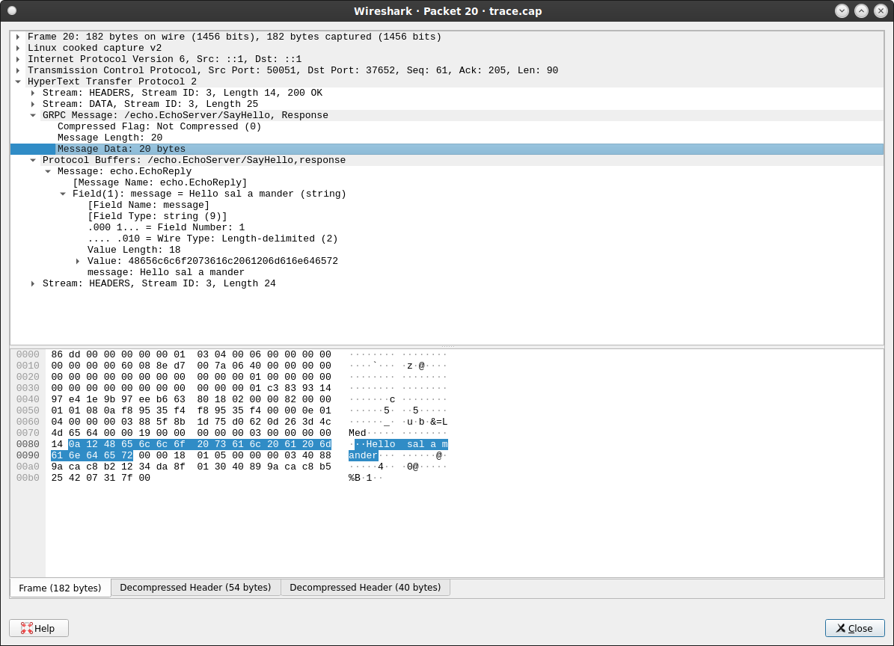

## gRPC Unary requests the hard way: using protorefelect, dynamicpb and wire-encoding to send messages


This is just an academic exercise to create a probuf message and its [wireformat](https://github.com/grpc/grpc/blob/master/doc/PROTOCOL-HTTP2.md) by basic reflection packages go provides.

`99.99%` of times you just generate go packages for protobuf `echo.pb.go` and its corresponding transport over gRPC `echo_grpc.pb.go`.  You would then use both to 'just invoke' an API:

```golang
import echo "github.com/salrashid123/grpc_dynamic_pb/example/src/echo"

c := echo.NewEchoServerClient(conn)
r, err := c.SayHello(ctx, &echo.EchoRequest{FirstName: "sal", LastName: "amander"})
```


However, just as a way to see what you can do under the hood using 'first principles' we will instead for the following `.proto`:

```protobuf
syntax = "proto3";

package echo;
option go_package = "github.com/salrashid123/grpc_dynamic_pb/example/src/echo";

service EchoServer {
  rpc SayHello (EchoRequest) returns (EchoReply) {}
}

message EchoRequest {
  string first_name = 1;
  string last_name = 2;
}

message EchoReply {
  string message = 1;
}
```

1. Load and Register its binary protobuf definition `echo.pb`
2. Create an `EchoRequest` message using [protoreflect](https://pkg.go.dev/google.golang.org/protobuf/reflect/protoreflect) and [dynamicpb](https://pkg.go.dev/google.golang.org/protobuf/types/dynamicpb)
3. Either

     * a. Create Message Descriptor add fields
  
     * b. Create Message using anypb and protojson

4. Encode that message into gRPC's Unary wireformat
5. Send that to a gRPC server using _an ordinary `net/http` client over `http2`
6. Recieve the wireformat response
7. decode the wireformat to a protobuf message
8. Convert the message to `EchoReply`
9. print the contents of `EchoReply`


What does that prove?  not much, its just academic thing i did...learning something new has its perpetual rewards..

for some background, also see

* [grpc with curl](https://blog.salrashid.dev/articles/2017/grpc_curl/)
* [Using Wireshark to decrypt TLS gRPC Client-Server protobuf messages](https://blog.salrashid.dev/articles/2021/wireshark-grpc-tls/)
* [Envoy TAP filter for gRPC](https://blog.salrashid.dev/articles/2021/envoy_tap/)


---

So, let just see a normal gRPC client server:

### Standard Client/Server

```bash
# run server
cd grpc_services/
go run src/grpc_server.go --grpcport :50051

# run client
go run src/grpc_client.go --host localhost:50051
```

What this does is just send back a unary response..nothing to see here, move along


### The hard way

Next is what this article is about.  `grpc_client_dynamic.go` does a couple of things:

1. Load `echo.pb`

First step is for your go app to even know about the protobuf...so we need to load it so protoreflect knows about it

```golang
	protoFile, err := ioutil.ReadFile("grpc_services/src/echo/echo.pb")

	fileDescriptors := &descriptorpb.FileDescriptorSet{}
	err = proto.Unmarshal(protoFile, fileDescriptors)

	pb := fileDescriptors.GetFile()[0]
	fd, err := protodesc.NewFile(pb, protoregistry.GlobalFiles)

	err = protoregistry.GlobalFiles.RegisterFile(fd)

```

2. Create Message

Next we construct our `echo.EchoRequest` using the protodescriptor from step 1.

I found two ways to do this:  in `3a` below, we will "strongly type" create a message and in `3b`, we will create a message using a JSON string.   (the latter is more dangerous and is subject to simple typos)

```golang

```

3. `(a)` Create Message Descriptor add fields

In the following, you know which type you want to create so we do this by hand:

```golang
	echoRequestMessageType, err := protoregistry.GlobalTypes.FindMessageByName("echo.EchoRequest")
	echoRequestMessageDescriptor := echoRequestMessageType.Descriptor()

	fname := echoRequestMessageDescriptor.Fields().ByName("first_name")
	lname := echoRequestMessageDescriptor.Fields().ByName("last_name")

	reflectEchoRequest := echoRequestMessageType.New()
	reflectEchoRequest.Set(fname, protoreflect.ValueOfString("sal"))
	reflectEchoRequest.Set(lname, protoreflect.ValueOfString("amander"))
	fmt.Printf("EchoRequest: %v\n", reflectEchoRequest)

	in, err := proto.Marshal(reflectEchoRequest.Interface())

	fmt.Printf("Encoded EchoRequest using protoreflect %s\n", hex.EncodeToString(in))
```

Note that we're manually defining everything...its excruciating

3. `(b)` Create Message using anypb and protojson

In the following, we will "just create" a message using its JSON format. Remember to set the `@type:` field in json

```golang
	j := `{	"@type": "echo.EchoRequest", "firstName": "sal",	"lastName": "amander"}`
	a, err := anypb.New(echoRequestMessageType.New().Interface())

	err = protojson.Unmarshal([]byte(j), a)
	fmt.Printf("Encoded EchoRequest using protojson and anypb %v\n", hex.EncodeToString(a.Value))
```

4. Encode it to the wireformat

Either way, we need to convert the proto message into a wireformat.  For this we use [lencode](https://github.com/psanford/lencode)

```golang
	in, err := proto.Marshal(reflectEchoRequest.Interface())
	var out bytes.Buffer
	enc := lencode.NewEncoder(&out, lencode.SeparatorOpt([]byte{0}))
```

You might be asking ...wtf is `lencode.SeparatorOpt([]byte{0})`

...weeellll, thats just the wireformat position that signals compression..it works here.  See [parsing gRPC messages from Envoy TAP](https://github.com/psanford/lencode/issues/5)

5. Send message

We're now ready to transmit the wireformat message to our grpc server


We're going to have to fake out TLS here some reasons described [here](https://medium.com/@thrawn01/http-2-cleartext-h2c-client-example-in-go-8167c7a4181e)

```bash
	client := http.Client{
		Transport: &http2.Transport{
			AllowHTTP: true,
			DialTLS: func(network, addr string, cfg *tls.Config) (net.Conn, error) {
				return net.Dial(network, addr)
			},
		},
	}

	reader := bytes.NewReader(out.Bytes())
	resp, err := client.Post("http://localhost:50051/echo.EchoServer/SayHello", "application/grpc", reader)
```

6. Recieve the wireformat response

read in the bytes inside `resp.Body`

7. decode the wireformat to a protobuf message

Use `lencode` to unmarshall the payload

```golang
	respMessage := lencode.NewDecoder(bytesReader, lencode.SeparatorOpt([]byte{0}))
	respMessageBytes, err := respMessage.Decode()
```

8. Convert the message to `EchoReply`

We now do the inverse of the outbound steps still using the descriptors we originally setup

```golang
	echoReplyMessageType, err := protoregistry.GlobalTypes.FindMessageByName("echo.EchoReply")

	echoReplyMessageDescriptor := echoReplyMessageType.Descriptor()
	pmr := echoReplyMessageType.New()

	err = proto.Unmarshal(respMessageBytes, pmr.Interface())

	msg := echoReplyMessageDescriptor.Fields().ByName("message")

	fmt.Printf("EchoReply.Message using protoreflect: %s\n", pmr.Get(msg).String())
```

9. print the contents of `EchoReply`

We now have the message back...we can print it.

done


TO run it end-to end, keep the server running and invoke the client

```bash
$ go run grpc_client_dynamic.go 
		Registering MessageType: EchoRequest
		Registering MessageType: EchoReply
		EchoRequest: first_name:"sal"  last_name:"amander"
		Encoded EchoRequest using protoreflect 1207616d616e6465720a0373616c
		Encoded EchoRequest using protojson and anypb 0a0373616c1207616d616e646572
		wire encoded EchoRequest: 000000000e1207616d616e6465720a0373616c
		wire encoded EchoReply 00000000130a1148656c6c6f2073616c20616d616e646572
		Encoded EchoReply 0a1148656c6c6f2073616c20616d616e646572
		Echoreply.Message: Hello sal amander
```

What the output shows is how we loaded the `echo.pb`, then constructed the Message from either explicitly creating it or by converting a JSON Message over. 

Once that was done, we sent the wire-encoded message to the server and reversed the process.


Did i mention you can also use `curl` to call the endpoint...

the trick is to use the wire encoded format (since,  you know, curl send stuff on the wire

```bash
echo -n '000000000e0a0373616c1207616d616e646572' | xxd -r -p - frame.bin
 
curl -v  --raw -X POST --http2-prior-knowledge  \
    -H "Content-Type: application/grpc" \
    -H "TE: trailers" \
    --data-binary @frame.bin \
       http://localhost:50051/echo.EchoServer/SayHello -o resp.bin
```

to decode

```bash
$ xxd -p resp.bin 
00000000130a1148656c6c6f2073616c20616d616e646572

$ echo -n "0a1148656c6c6f2073616c20616d616e646572" | xxd -r -p | protoc --decode_raw
1: "Hello sal amander"

```



---

### Using github.com/jhump/protoreflect

This repo also contains an end-to-end sample of [github.com/jhump/protoreflect](https://github.com/jhump/protoreflect).

Using that library makes certain things a lot easer as it wraps some of the legwork for you.  You can also "just load" a `.proto` file that includes specifications of the Message and gRPC server.

To use that,

```bash
cd jhump_client/
$ go run grpc_client_jhump.go 
> service echo.EchoServer
  * method echo.EchoServer.SayHello (echo.EchoRequest) echo.EchoReply
- message echo.EchoRequest
- message echo.EchoReply
Looking for serviceName echo.EchoServer methodName SayHello
Response: {
	"message": "Hello sal amander"
}
```

---
#### gRPC Reflection

The default gRPC server here also has [gRPC Reflection](https://github.com/grpc/grpc/blob/master/doc/server-reflection.md) enabled for inspection.

To use this, you have to install [grpc_cli](https://github.com/grpc/grpc/blob/master/doc/command_line_tool.md) (which, TBH, is way too cumbersome!)

Anyway

```bash
$ ./grpc_cli ls localhost:50051
	echo.EchoServer
	grpc.health.v1.Health
	grpc.reflection.v1alpha.ServerReflection

$ ./grpc_cli ls localhost:50051 echo.EchoServer -l
	filename: src/echo/echo.proto
	package: echo;
	service EchoServer {
		rpc SayHello(echo.EchoRequest) returns (echo.EchoReply) {}
	}


$ ./grpc_cli ls localhost:50051 echo.EchoServer.SayHello -l
	rpc SayHello(echo.EchoRequest) returns (echo.EchoReply) {}

$ ./grpc_cli type localhost:50051 echo.EchoRequest
	message EchoRequest {
		string first_name = 1 [json_name = "firstName"];
		string last_name = 2 [json_name = "lastName"];
	}

./grpc_cli call localhost:50051 echo.EchoServer.SayHello "first_name: 'sal' last_name: 'amander'"
	connecting to localhost:50051
	message: "Hello sal amander"
	Rpc succeeded with OK status
```

---

done
